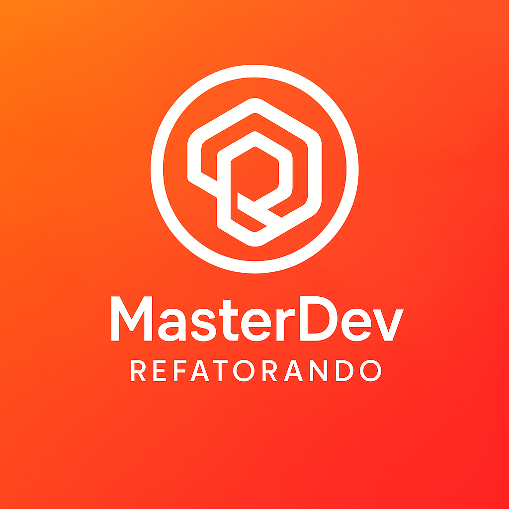

# 🍽️ Restaurante Sabor Vivo

Projeto desenvolvido como parte do desafio MasterDev – Refatorando, inspirado no formato do MasterChef, para praticar desenvolvimento web em equipe.

# 🚀 Objetivo do Projeto

Criar um site funcional para o restaurante fictício Sabor Vivo, aplicando conceitos de desenvolvimento web, boas práticas de código e trabalho colaborativo.

A ideia é que cada equipe replique e evolua a estrutura base do projeto, trabalhando como se fosse um time real de tecnologia.

# 👨‍🍳 Como Vai Funcionar

Mostrar Estrutura do Projeto – apresentação da base já preparada.

Divisão de Times – os participantes serão organizados em equipes.

Vocês replicam e evoluem – cada grupo implementa melhorias e funcionalidades.

Avaliação e suporte – os mentores analisam o trabalho e dão feedback.

Entrega – cada equipe entrega a versão final na próxima semana.

Mentores (apelidos inspirados no MasterChef):

- 👨‍🍳 Roger (Fogaça)

- 👩‍🍳 Taci (Paola)

- 👨‍🍳 Aurélio (Jacquin)

# 🛠️ Tecnologias Sugeridas

HTML5 / CSS3

📂 Estrutura Básica do Projeto

A estrutura inicial será fornecida no repositório para todos os times.

💻 Recursos Disponíveis

- Grupo no WhatsApp – comunicação rápida entre os membros.
- Calls no Teams – reuniões de alinhamento com mentores.
- Repositório GitHub – estrutura base do projeto e readme inicial.
- Deploy no GitHub Pages – site publicado para visualização.

🔗 Site de exemplo: [Restaurante Sabor Vivo](https://tboniifacio.github.io/Restaurante-Sabor-Vivo/) 

🏆 Recompensas

Medalha exclusiva na plataforma Refatorando para quem concluir o desafio.

Feedback personalizado dos mentores sobre código, UX e arquitetura.

✅ Entrega

- Replicar o Projeto

✅ Ponto Extra
- Subir no Github
- Publicar no GitHub Pages.
- Customização e melhorias no projeto.

Enviar o link final até o final da proxima aula.
